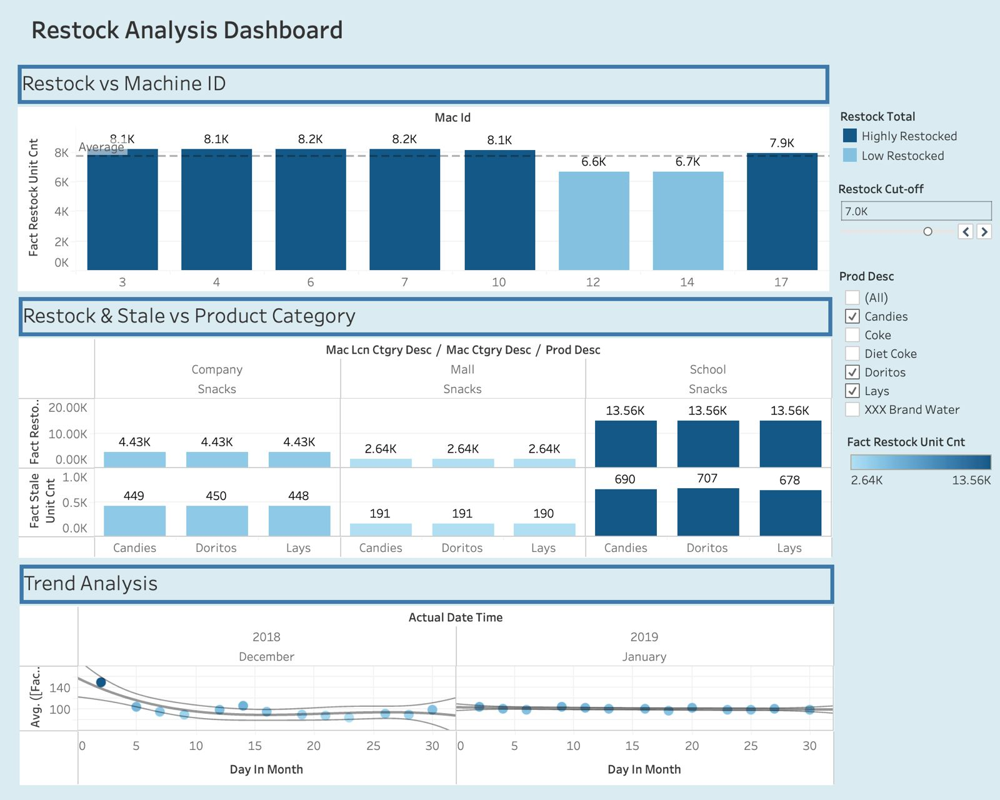

# Restock Analysis Dashboard

The Restock Analysis Dashboard provides an in-depth analysis of **product restocking** and **stale inventory** across different machines and product categories.
It is designed for inventory and supply chain managers to monitor restocking needs, identify trends, and minimize stale inventory to improve supply efficiency.

---

## Preview

---

## Dashboard Sections

### 1. Restock vs Machine ID

* Bar chart showing restock unit count per machine ID
* Highlights the **average restock count**
* Identifies machines with **high and low restock rates**
* Includes a **Restock Cut-off filter** to categorize machines

### 2. Restock & Stale vs Product Category

* Comparative bar charts for restock and stale counts
* Segmented by **location categories**: Company, Mall, and School
* Product-level breakdown (Candies, Doritos, Lays, etc.)
* Filter for product descriptions to analyze specific items

### 3. Trend Analysis

* Line chart tracking average restock counts over time
* Covers **December 2018 to January 2019**
* Shows **daily fluctuations** and seasonal restocking patterns
* Useful for **forecasting demand and scheduling supplies**

---

## Usage

This dashboard can be used by **inventory and supply chain teams** to:

* Monitor restock frequencies across machines and product categories
* Identify machines or product categories with **high stale inventory** to reduce waste
* Forecast restocking needs using **historical demand trends**
* Optimize supply schedules and improve operational efficiency

---

## Tech Stack

* **Visualization Tool:** Tableau
* **Data Handling:** Pre-processed transactional dataset
* **Focus Areas:** Restock tracking, stale inventory analysis, demand forecasting

---

## Portfolio Value

This project demonstrates:

* Ability to design **interactive dashboards** for operational decision-making
* Skills in **data visualization and storytelling with Tableau**
* Practical application of analytics for **inventory optimization**
